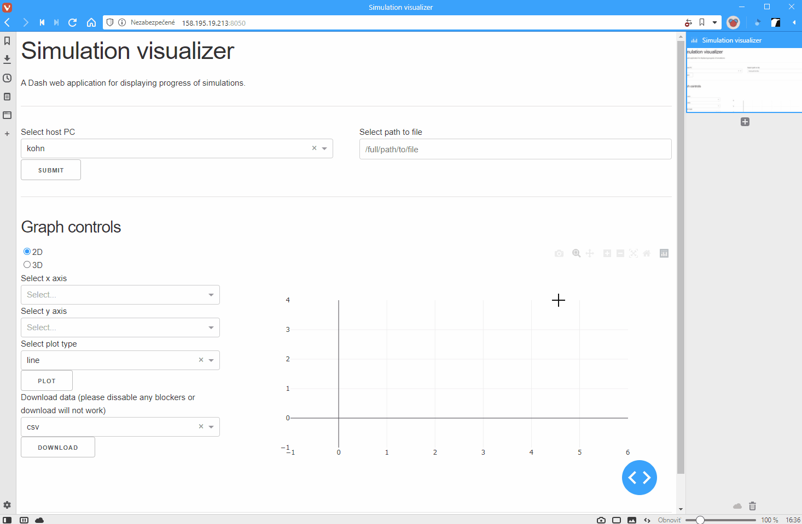

# Simulation visualizer

Has the ability to load and plot various data formats (depending on available plugins)
from any servers defined in` ~/.ssh/config file`. Currently supported formats are:

- Plumed COLVAR
- DeepMD-kit training lcurve.out format
- LAMMPS log file with custom thermo style without multiline
- DeepMD-kit LAMMPS pair style model deviation output

# Deploy

There are two options. You can use already running version which is hosted on
[Dusanko](http://158.195.19.213:8050) this should be always up and running. It
has defined keys for all available machines (Kohn, Hartree, Fock, Schrodinger,
Landau, Aurel) The only problem you could possibly encounter is related to file
access privilages. As the server runs on `Dusanko` it logs in as user `rynik` so
this might stop the server from accessing some files. It happens sometimes mostly
with files written by programs that where run through PBS job manager.

The second option is to deploy locally:

```bash
pip install git+https://github.com/ftl-fmfi/simulation-visualizer.git
visualizer -vvvv & # for full debug mode and leave it running in the background
```

This option assumes that you have generated ssh keys for servers you will want
to access.

# Writing new parsers

Writing new plugin to handle arbitrary data format is rather easy. One must follow
few simple rules:
* The parser must be self contained in one file
* Parser class must inherit from [`FileParser`](https://github.com/ftl-fmfi/simulation-visualizer/blob/9b37c9382200df023bbd2e126b018ecd12319054/simulation_visualizer/parser.py#L51)
base class which defines parser API and takes care of auto plugin loading through
metaclass magic.
* each parser must override `FileParser` abstract methods and optionally
* New plugins can be added to running server which will auto-load them on the fly.
* All parser methods must be class methods, the parser will not be instantiated!

There is an [example file](simulation_visualizer/parsers/example_plugin.py) prepared for convenience which should help you
write a plugin in no time. 


# Example



# TODO

- add progressbar when loading large files
- clearer error messages showing as detailed report as possible
- repair servers sometimes spontaneously relaoding